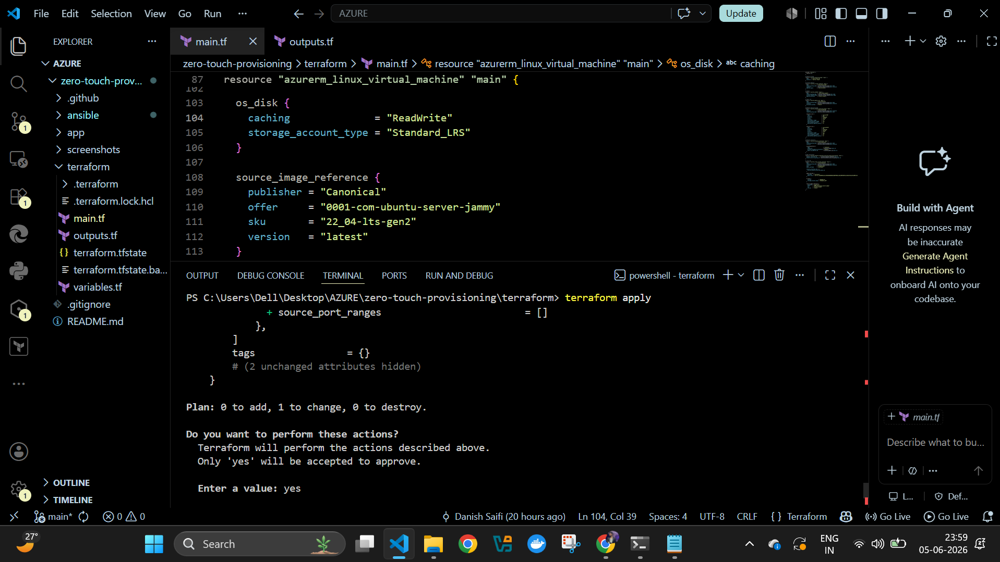
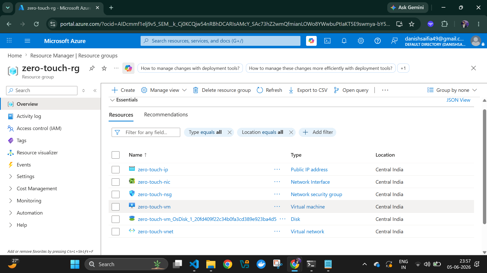
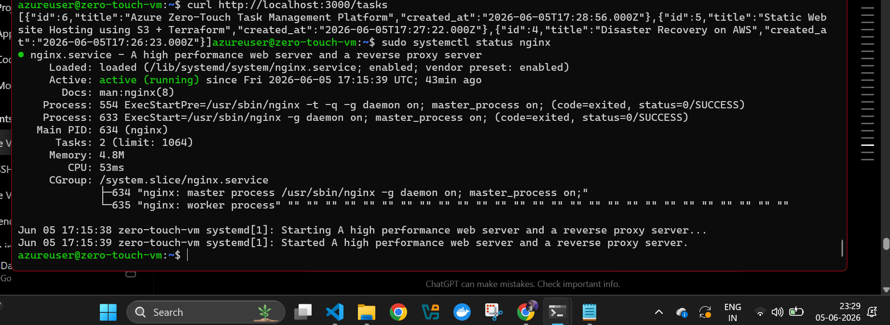
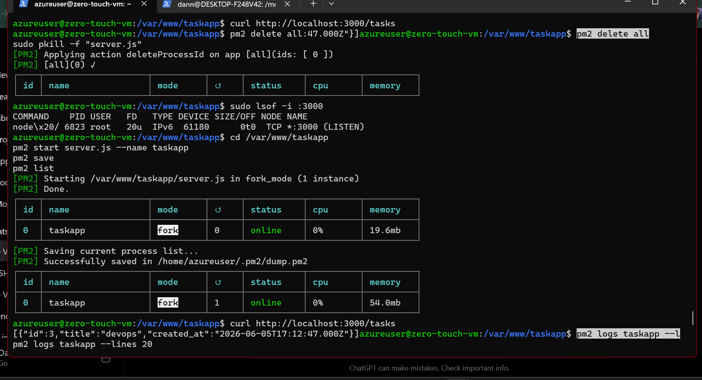
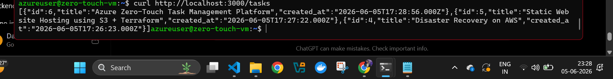
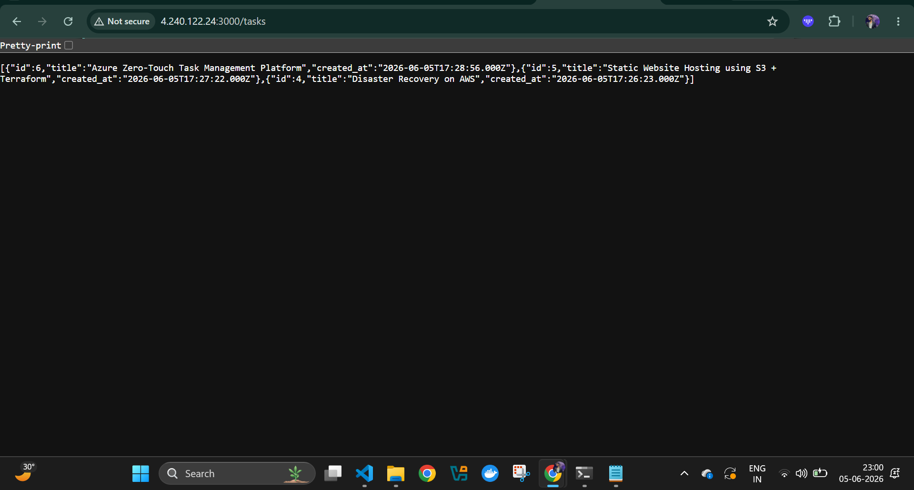
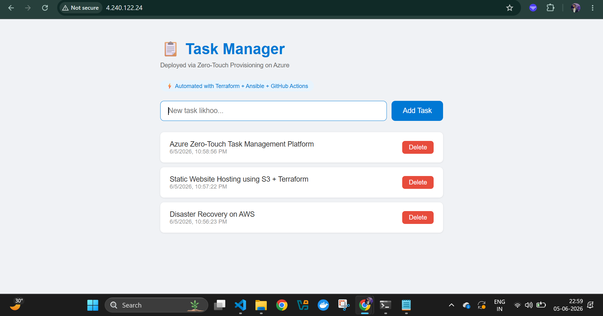

# Zero-Touch Infrastructure Provisioning & Automated Application Deployment on Microsoft Azure

## Project Overview

This project demonstrates a fully automated Infrastructure as Code (IaC) and Configuration Management workflow for deploying a production-ready multi-tier Task Management application on Microsoft Azure.

The entire infrastructure provisioning, server configuration, application deployment, and service orchestration process is automated using Terraform, Ansible, and GitHub Actions, eliminating manual server setup and ensuring consistent, repeatable deployments.

---

## Business Objective

Traditional server provisioning and application deployment processes are often time-consuming, error-prone, and dependent on manual intervention.

This project addresses these challenges by implementing a Zero-Touch Deployment Architecture that enables infrastructure creation and application deployment through a single GitHub push.

---

## Technology Stack

### Cloud Platform

* Microsoft Azure

### Infrastructure as Code (IaC)

* Terraform

### Configuration Management

* Ansible

### CI/CD Automation

* GitHub Actions

### Backend

* Node.js
* Express.js

### Database

* MySQL

### Web Server & Reverse Proxy

* Nginx

### Process Management

* PM2

### Version Control

* Git & GitHub

---

## Solution Architecture

GitHub Repository
↓
GitHub Actions CI/CD Pipeline
↓
Terraform Infrastructure Provisioning
↓
Azure Resource Group + Virtual Machine + Networking
↓
Ansible Configuration Management
↓
Nginx + Node.js + MySQL + PM2 Deployment
↓
Production-Ready Task Management Application

---

## Key Features

* Automated Azure Infrastructure Provisioning
* Infrastructure as Code (IaC) Implementation
* End-to-End CI/CD Pipeline Automation
* Zero-Touch Server Configuration
* Automated Application Deployment
* Reverse Proxy Configuration with Nginx
* Process Management using PM2
* Multi-Tier Application Architecture
* Repeatable & Scalable Deployment Workflow
* Production-Oriented Environment Setup

---

## Deployment Workflow

1. Developer pushes code to GitHub.
2. GitHub Actions pipeline is triggered automatically.
3. Terraform provisions Azure infrastructure resources.
4. Azure Virtual Machine and networking components are created.
5. Ansible configures the operating system and required services.
6. MySQL, Node.js, PM2, and Nginx are installed automatically.
7. Application files are deployed to the target server.
8. Nginx is configured as a reverse proxy.
9. PM2 manages application lifecycle and availability.
10. Application becomes accessible through the Azure Public IP.

---

## Project Outcomes

* Reduced deployment effort through full automation.
* Eliminated manual server provisioning and configuration tasks.
* Achieved consistent and repeatable deployments.
* Demonstrated Infrastructure as Code and Configuration Management best practices.
* Implemented a complete DevOps workflow from code commit to production deployment.

---

## Screenshots

### 1. Terraform Infrastructure as Code

### 2. Terraform Apply Success

### 3. Azure Resource Group Resources

### 4. Azure Virtual Machine

### 5. Network Security Group Rules

### 6. GitHub Actions CI/CD Pipeline

### 7. Ansible Automated Deployment

### 8. Nginx Reverse Proxy Service

### 9. PM2 Process Management

### 10. API Endpoint Verification

### 11. API Response Validation

### 12. Running Task Manager Application

---

## DevOps Skills Demonstrated

* Azure Cloud Administration
* Terraform
* Infrastructure as Code (IaC)
* Ansible Automation
* CI/CD Pipeline Design
* GitHub Actions
* Linux Administration
* Nginx Configuration
* Node.js Deployment
* MySQL Administration
* Process Management with PM2
* Automation & Orchestration
* Cloud Infrastructure Management

---

## Future Enhancements

* Containerization using Docker
* Kubernetes Deployment (AKS)
* Monitoring with Prometheus & Grafana
* Centralized Logging with ELK Stack
* Blue-Green Deployment Strategy
* Load Balancing & Auto Scaling
* SSL/TLS Automation with Let's Encrypt
